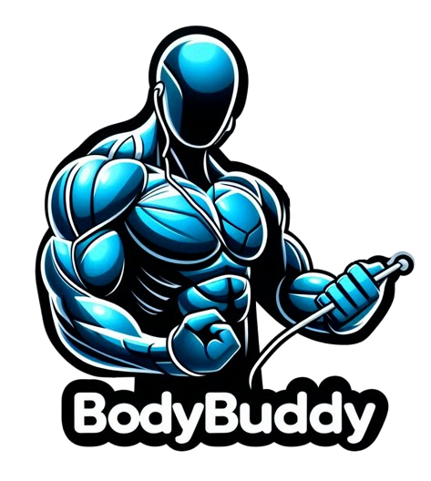

<p align="center"></img></p>

BodyBuddy is a fitness exercise app built with React 18. Get ready to elevate your fitness journey to the next level!

## Features

- **Exercise Recommendations**: Receive personalized exercise recommendations based on your target areas and fitness goals.

- **User-Friendly Interface**: Navigate the app with ease thanks to its intuitive and modern user interface.

## Getting Started

### Prerequisites

- Node.js (version 14 or higher)
- npm (version 7 or higher)

### Installation

1. Clone the repository:

```bash
git clone https://github.com/NebulaTris/bodybuddy.git
```

2. Navigate to the project directory:

```bash
cd bodybuddy
```

3. Install dependencies:

```bash
npm install
```

### Usage

1. Start the app:

```bash
npm start
```

2. Open your preferred web browser and go to [http://localhost:3000](http://localhost:3000).

## Contributing

We welcome contributions from the community! If you'd like to enhance BodyBuddy, please follow these steps:

1. Fork the repository and create your branch:

```bash
git checkout -b feature/YourFeature
```

2. Commit your changes:

```bash
git commit -m "Add YourFeature"
```

3. Push to your branch:

```bash
git push origin feature/YourFeature
```

4. Open a pull request with a detailed description of your changes.

## License

This project is licensed under the MIT License - see the [LICENSE](LICENSE) file for details.

## Acknowledgments

- Special thanks to the React community for their continuous support and contributions.

- The bodybuddy team extends gratitude to the open-source community for their invaluable resources.

---

Feel free to customize this README according to your project's specific details. Happy coding and exercising with bodybuddy! 🏋️‍♂️💪
